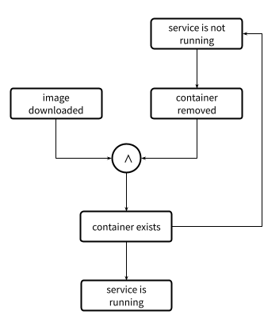

# Goal Engine (experimental, to be named)

A declarative toolkit for writing self-healing system agents.

This tool provides a library for creating control systems that need to operate with little to no feedback from a centralized control.
This is particularly useful in edge computing applications, where connectivity to the Internet may not be guaranteed, but system
operation needs to continue to function, and recover in the case of power outages or subsystem failures.

- **Fully declarative typescript API:** no need to write how the system will behave. Just declare the system goals and their dependencies and
  the library will figure out the best path between the current state of the system and a given target.
- **Integrated error management:** all operations failures are handled in a centralized way, the failing operation and the cause are communicated,
  and the overall execution is interrupted so it can be retried.
- **Monitor the state of the system:** as the declared system goals conform a graph, that makes it easy to observe state of the system and of the
  overall operation. Future improvements will make it easier to add a visualization layer for better observability.
- **Minimal dependencies:** the core library is mostly self contained and the API makes use of dependency injection for interaction with other systems.

## How does it work?

The unit of execution of the library is a `Goal`. A goal encodes a specific state of the underlying system that is desired. A goal is specified at minimum by

- a mechanism to get a piece of state, e.g. the directory contents,
- a way to test if the goal has been achieved, e.g. a given file exists in a directory.

Additionally a goal can be actionable, meaning it may specify a mechanism to reach the goal if it has not been met yet, e.g. create the file. Finally a goal may specify
dependencies, which are goals that need to be met before the goal action can be tried, e.g. target directory needs to allow write access.

Given a specific target goal, the runtime will backtrack from the target looking for unmet dependencies, and will try to seek those actionable dependencies
in order until the target is met.

Example:

Let's say we have a sub-system controlled by a configuration file `/etc/dummy.conf`, that may include a configuration variable
`loglevel` to control the system verbosity with the possible values `info` or `error`.

Let's write first a system to check if the level is set to a specific value. This is how to do it with the library

```typescript
import { Goal, StateNotFound } from 'goal-engine';
import { promises as fs } from 'fs';

// Defines a context type for the goal
type LogContext = {
	configPath: string;
	level: 'info' | 'error';
};

const LogLevel = Goal.of({
	// state defines a way to get the system state independent of the goal, in this
	// case, state returns the contents of the configuration file.
	state: ({ configPath }: LogContext) =>
		fs.readFile(configPath, { encoding: 'utf8' }).catch((e) => {
			// the StateNotFound exception tells the engine to not terminate, but consider this
			// case the same that with a failed test
			throw new StateNotFound(`Configuration file not found: ${configPath}`, e);
		}),

	// The test checks if the goal is met. This won't be called if the file does not exist
	test: ({ level }: LogContext, contents: string) =>
		contents
			.split(/\r?\n/)
			// Return true if a line with the given level exists
			.some((line) => new RegExp(`loglevel=${level}`).test(line)),
});

// This will succeed if the configuration already exists with the value `info`
await LogLevel.seek({ configPath: '/etc/dummy.conf', level: 'info' });
```

This is not terribly useful though, let's now add a way to control the logging level. We can do this by adding an `action`, which is the mechanism through which the goal can be achieved.

```typescript
const LogLevel = Goal.of({
	/** state and test definitions go here */
	action: ({ configPath, level }: LogContext, contents = '') =>
		fs.writeFile(
			configPath,
			contents
				.split(/\r?\n/)
				// Remove any lines with log configuration
				.filter(
					(line) =>
						line.trim().length > 0 && !new RegExp(`loglevel=.+`).test(line),
				)
				// Append the new configuration line
				.concat(`loglevel=${level}`)
				// Join the file with newline
				.join('\n'),
			'utf8',
		),
});

// This will check for the logging configuration and will change it to `info` if
// is set to some other value
await LogLevel.seek({ configPath: '/etc/dummy.conf', level: 'info' });
```

Calling `seek` will try to achieve the goal. If the configuration is already set at the right level, it will terminate
immediately, otherwise it will modify the file with the right loglevel.

Note that we do not do any error handling on the action. The execution of the goal will catch any errors
when trying to seek the goal, it will inform through the logging system that an error has occurred and where in the
runtime, and the call to `seek()` will return `false`;

Now let's say that we want to make sure some other goal is met before we apply the configuration. This could be anything: that
the service is running, that a mountpoint exists, etc. For simplicity, let's say we want to check that the configuration file exists before we can write to it.
We can first create a generic goal for checking the existence of a file.

```typescript
const FileExists = Goal.of({
	state: (filePath: string) =>
		fs
			.access(filePath)
			.then(() => true)
			.catch(() => false),
	test: (_: string, exists: boolean) => exists,
	action: (filePath: string) => fs.open(filePath, 'w').then((fd) => fd.close()),
});

// This creates the file /tmp/hello if it doesn't exist
await FileExists.seek('/tmp/hello');
```

And now we can link our `LogLevel` goal with our newly created `FileExists` goal.

```typescript
const LogLevel = Goal.of({
	/** state, test and action definitions go here */
})
	// FileExists.map creates a new goal that receives a LogContext as input.
	// We need to use map so the expected inputs match.
	.requires(FileExists.map(({ configPath }: LogContext) => configPath));

// This will first create the configuration file if it does not exist
// and then add the given configuration data
await LogLevel.seek({ configPath: '/etc/dummy.conf', level: 'info' });
```

The `before` property establishes a requirement between the `LogLevel` goal and the `FileExists` goal. It tells the engine that
before the `LogLevel` action can be tried, the requirements need to be met. The engine will backtrack to try to meet the required
goals.

Again, if an error occurs at any stage, the engine will report the error message and the error location to the logging system and the `seek` call
will return false.

If the process is interrupted at any step, calling `seek` will perform any missing operations required to meet the goal.

This is a very simple example, but illustrates the advantages of the approach.

## Example

A more complex example can be found on the [examples/](./examples/) folder. The example implements a simple docker service controller.
The following graph describes dependencies between the goals of the system.



Note the `∧` symbol in the graph. This indicates a logic `and`
operation between goals, that tells the engine that both goals linked by the symbol (`image downloaded` and `container removed`) must be met
before the goal `container exist` can be tried.

Running

```
npm install && npm run example
```

will launch a docker container (requires docker installed) with the name `my-project_main` and the command `sleep infinity`.

See what happens if you run the command again. See what happens if you change the command in [examples/index.ts](./examples/index.ts) to

```
cmd: ['sleep', '30'],
```

## Documentation

**TODO**

### State

### Test

### Action

### Goal

### Goal operations
